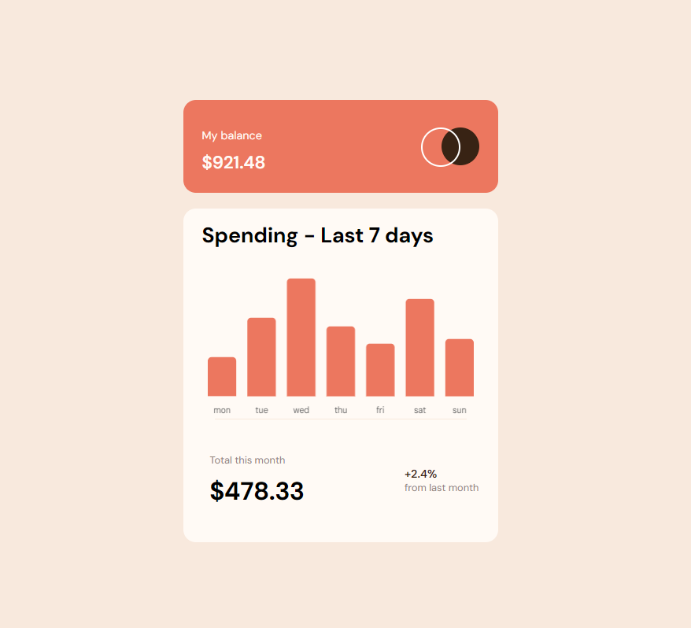
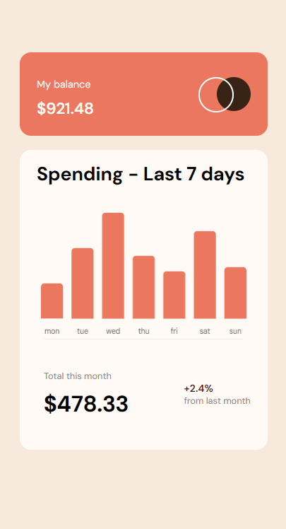
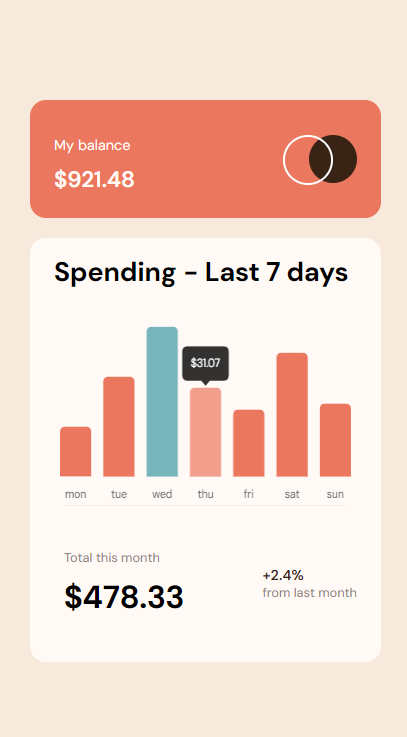

# Frontend Mentor - Expenses chart component solution

This is a solution to the [Expenses chart component challenge on Frontend Mentor](https://www.frontendmentor.io/challenges/expenses-chart-component-e7yJBUdjwt). Frontend Mentor challenges help you improve your coding skills by building realistic projects.

## Table of contents

- [Overview](#overview)
  - [The challenge](#the-challenge)
  - [Screenshot](#screenshot)
  - [Links](#links)
- [My process](#my-process)
  - [Built with](#built-with)
  - [What I learned](#what-i-learned)
  - [Useful resources](#useful-resources)
- [Author](#author)
- [Acknowledgments](#acknowledgments)

## Overview

### The challenge

Users should be able to:

- View the bar chart and hover over the individual bars to see the correct amounts for each day
- See the current day’s bar highlighted in a different colour to the other bars
- View the optimal layout for the content depending on their device’s screen size
- See hover states for all interactive elements on the page
- **Bonus**: Use the JSON data file provided to dynamically size the bars on the chart

### Screenshot

### Links

- Solution URL: [Add solution URL here](https://your-solution-url.com)

## My process

### Built with

- Semantic HTML5 markup
- CSS custom properties
- Flexbox
- CSS Grid
- Chart.js
- HTML Canvas

### What I learned

Further practice with CSS Psuedo-classes and Properties was enjoyable. The small refresher of working with json data and the fetch api was fun. The biggest hurdle was working with Chart JS and the not-very-usefull docs, luckily where there is a will there is a way.

### Useful resources

- [Official Chart JS Docs](https://www.chartjs.org/docs/latest/) - This is the official Chart.js Docs. Although as most docs it proved to be more of a headache than help.
- [Actually useful Chart JS Articles](https://www.chartjs3.com/) - Just use this instead and the official docs as a ref.
- [Chart JS YT Channel](https://youtube.com/@ChartJS-tutorials?si=oBjt2W_aX8DeymcM) - Very thurough videos on how Chart Js works

## Author

- Frontend Mentor - [@MikeJD47](https://www.frontendmentor.io/profile/MikeJD47)

## Acknowledgments

Have to say thanks to ~Chart.js~ YouTube Channel for clarifying a lot of things that I could not understand when looking at the documentation for Chart.js.
